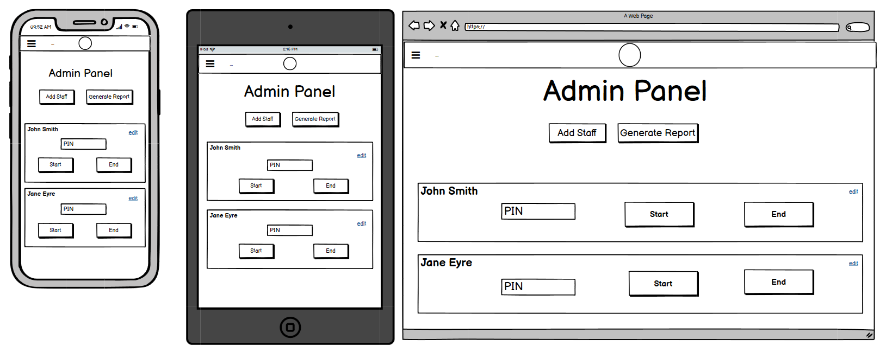
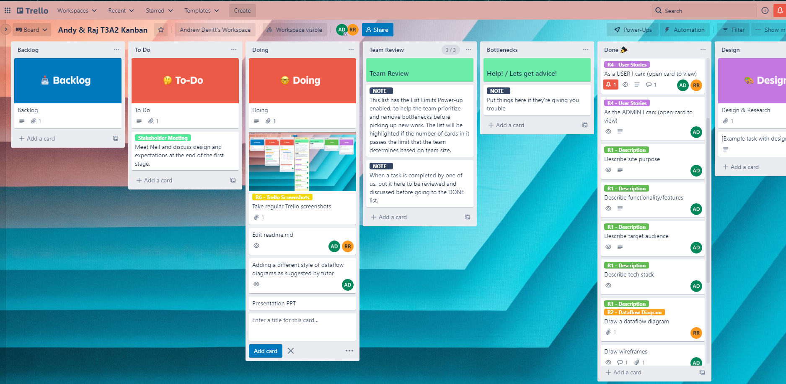

# T3A2A-Final-Coder-Assessment-Part-B

## Team Members

- Andrew Devitt
- Raj Ranj

## GitHub Repository
### React App
https://github.com/AnderDevitt/T3A2A-Final-Coder-Assessment-Part-A
### Rails Backend

## Presentation Slides
[slides_pdf_file](./docs/presentation.pdf)

## WEBSITE DESCRIPTION

This website is an application designed for a local cafe where the manager wishes to have a system that will track staff sign-in and sign-out times for their shifts and then allow the manager to output reports based on this data. The application will not be connected to any other systems such as employee databases or payroll, and is to be a self-contained app that will run on a tablet in the cafe for staff to use when clocking in and out, and the managers PC for administrator access.

## PURPOSE
### Stated
The application has two purposes. Firstly to allow staff to accurately record the start and end times of their shifts. The client brief states that this must be simple for staff to accomplish and as clear as possible. Shift data will be stored in a relational database.

The second purpose is to allow the admin to create and edit staff data, and most importantly, generate simple reports on the shift start and end times or workers. The reports generated will allow the manager to accurately check staff work times in the cafe and compare with the payroll department.

The first purpose has been achieved to an degree with a few ongoing issues and ,unfortunately, the libraries and approaches taken caused many work-arounds to be necessary to achieve this. There are some quirks that will be fixed in the next iteration. The second purpose (admin functionality) has been partially achieved.
### Achieved

## FUNCTIONALITY AND FEATURES 

### Site Navigation - Stated

The site will have a nav bar at the top of the screen which will allow navigation to all pages for a logged-in Administrator, the staff shifts page for cafe staff, and log-in/log-off options.

Pages have links and buttons to perform actions and navigate to new pages and back.

### Site Navigation - Achieved
The Navbar functions pretty much as the design required. There have been some changes, such as the links to admin functions being on the Admin Panel page rather than the Navbar itself.

As we were unable to complete the admin features, the planned links on pages were only partially implemented. This is something to complete after the assessment submission.  

### Main Page(s) for Staff (Cafe Page) - Achievement and Changes
The original design called for a single page which rendered each employee on a card with a form that took a pin (password) and had two buttons "start" and "stop". All of the initial code featured this, but while we could start and stop a shift (create and edit a shift in the database), we had trouble indicating when a shift was active. The eventual workaround divided this into two pages Cafe and Shifts. It's not ideal, and not as DRY as we would like, but it does achieve the required function.

What we have, it that and employee can begin a shift on the Cafe Home page, which displays a list of staff that are currently available to work. When an employee chooses to begin their shift, a popup window will open and they will be prompted to enter their username and pin to verify their id. A glitch that I was unable to solve (we tried a few times with educators assisstance) is that often any user can enter their credentials for another to begin that employee's shift.

Navigating the the Shifts Page shows any shifts that are currently running. From their card, users can see the date, when they clocked-in and can choose to end their shift, again by validating with pin and username. Unfortunately, again this didn't always work. Especially if check_ownership and authenticate_employee were used in the shifts controller in the api.  

We began the project following close to the client requirement that cafe staff only use their login to verify shifts. For most of the project we separate tables for admin and general cafe user accounts which logged into the app, and an employees table that had a password(pin) that was only used for shift start and end.

While it was working most of the time as intended, any code changes usually initiated new clashes between the passwords and authentication, and additionally it required a lot of doubling up. So at the last minute, I restructured the database to merge all user data into the one employees table. Then worked on the necessary coding in front and back ends to reflect this change and tried to remove as much of the extra components and code that were created building the old method.  

We had a react-clock rendering from a library on the cafe page as in the planning and wireframes, however the useEffect to increment the clock set off the useEffect for retrieving the list of employees from the backend every second. The advice from the troubleshooting trello was to move the clock. For a time this was working fine, but in the current code it needed to be temporarily removed. The client agreed with this as he did not want a clock on the page in the original brief.

### Admin Panel - Achievement
The admin currently can:

- Allow the Admin to open a form and create new staff.
- Allow the editing of an existing staff member's details.
- Allow staff status to be changed from active (available to work) and deactive (currently unavailable or no longer employed). Due to the nature of the database and purpose for this data, it is undesireable for staff data to be deleted at any time.

Most of the basic goals are done for the admin as required in the planning. Unfortunately the Report Generation (at the time of writing this) has not been operational.

### Generate Reports

This feature was not achieved to the planned degree. We will continue to work on this in future edits. It should at the least display a table of shifts for a given date range. 

## TARGET AUDIENCE

The cafe is a busy environment in the lobby of an office building in the Brisbane CBD. A lot of foot traffic and customers pass through the lobby throughout the day which creates an active work environment. This has been taken into account in the app design by the client and developers.

The application has two target audiences. First and foremost the client (the cafe manager) who will use the application to monitor staff shifts and assist in payroll checking. Most features of the application are for the use of the administrator. The second target group are the cafe employees, who will use it to clock in and out at work. This is the only interaction they need to perform with the app. There are a small number of employees on shift at any time, so they are occasionally very busy.

### The manager needs:

- Accurate times recorded for each employess who works on any day.
- To be able to add and edit staff details.
- Access to the data stored in the database in a clear and readable format.

### The staff need:

- Quick and simple access to the app on shift to minimise time waste.
- To see the current time that will be logged.
- Speedy authentication when they clock in/out.
- Clear indication that they have successfully clocked on/off.

## TECH STACK

The tech stack for this application will be the following.

### Code

#### Frontend:

- HTML
- JavaScript
- React
- Material UI & Styled Components
- CSS

#### Backend:

- Ruby
- Ruby on Rails

### Database

- PostgreSQL

### Source Control and Project Management

- Git
- Github
- Trello

### Deployment

- Netlify (frontend)
- Heroku (backend and database)

## USER STORIES

The user personas are: user, active staff member, admin.

User: In the context of the app, a user is a staff member with a password for the applicaion.
Active Staff Member: Staff members can be deactivated by the manager when they no longer work for the cafe or take an extended break. Active members are visible on the Web Client when staff are logging their shift times.
Admin: This is the manager for the cafe.

### User

- As a user I want to be able to log into the system with a general staff log-in, so that only staff can see the clock-in page and individual staff don't have to sign in to the system. (Changed in final version - they can now log in as themselves)
- As a user I want to log out of the system at the end of the cafe operating hours so that the app is secure. (Changed in final version - they can now log out as themselves)
- As a user I want to always see the shifts page and list of active staff during the cafe hours so that all staff can quickly begin and end their shifts from the one page. (Changed in final version - there are two distinct pages)

### Active Staff Member

- As an active staff member I want to do all the same things as a user.
- As an active staff member I want to enter my pin number so that I can authenticate my actions on the shifts screen.
- As an active staff member I want to click the start and end buttons so that I can begin or end my shift and record the correct time that I do so.
- As an active staff member I want to be able to see a system clock so that I know the exact time that will be recorded for my shift start and end. (Changed in final version - clock removed)

### Admin

- As the admin I want to do all the same things as an active staff member.
- As the admin I want to see admin options added to the shifts screen, so that I can perform additional functions (create user, edit user, generate report).
(Changed to their own Admin Panel screen)
- As the admin I want to add new staff members when people join the team.
- As the admin I want to be able to edit a staff member's details, so that I can update their information, reset forgotten pins, and change active status. 
- As the admin I want to deactivate staff members who leave and reactivate returning staff, so that only staff currently working are displayed on the shifts screen.
- As the admin I want to deactivate staff who leave so that they remain in the database and I do not need to delete their data.
- As the admin I want to be able to edit my own details so that I can change my username and password. (Changed - function was created and worked but deemed unnecessary by client at this time)
- As the admin I want to generate a report on staff work times for a given period so that I can compare times worked with payroll data. (Not achieved yet)

## PROJECT MANAGEMENT

Our team has used Trello as a project management tool.

